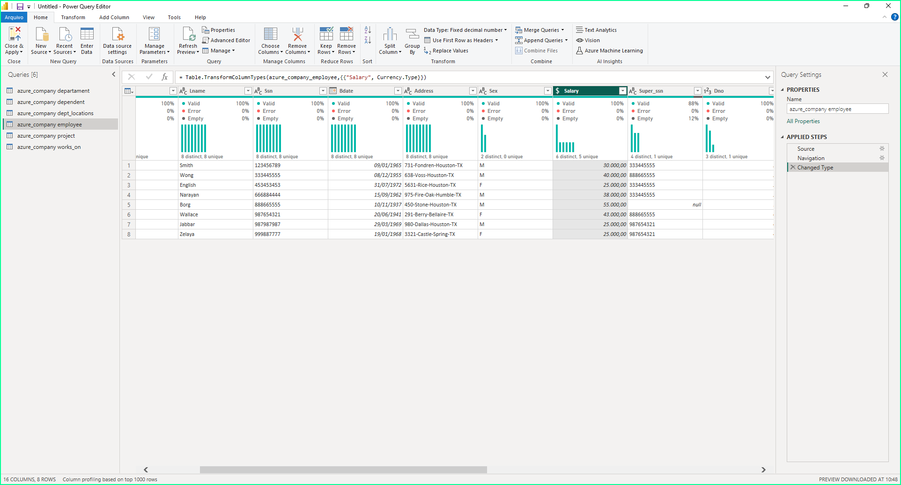
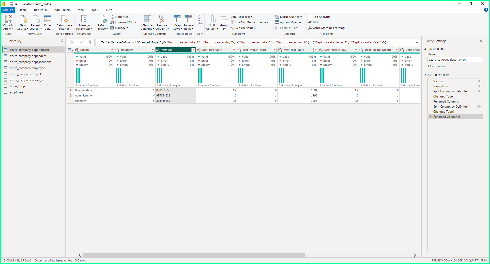
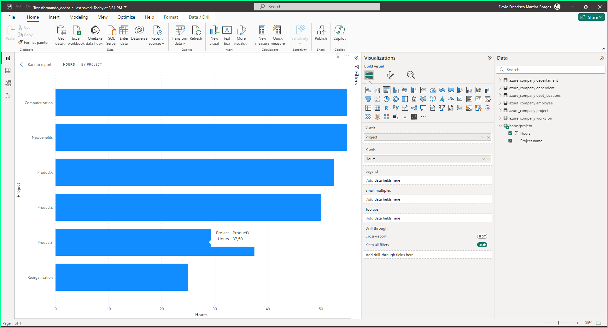
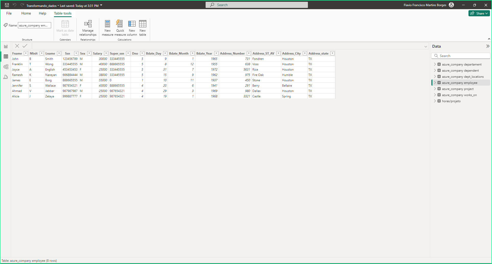
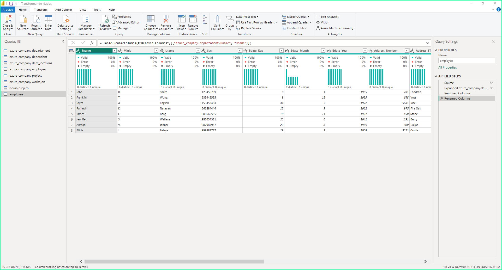
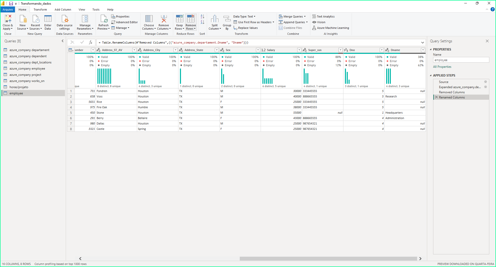
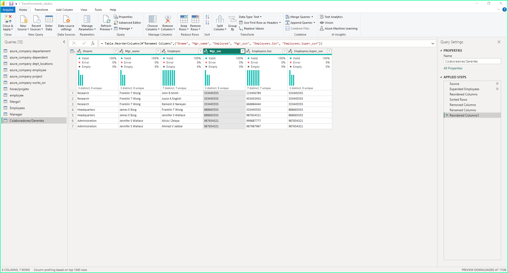
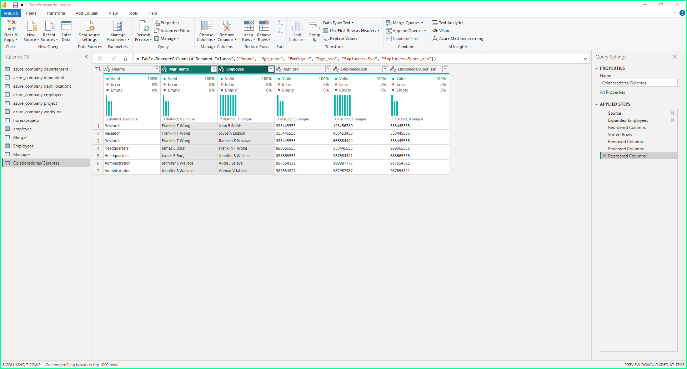
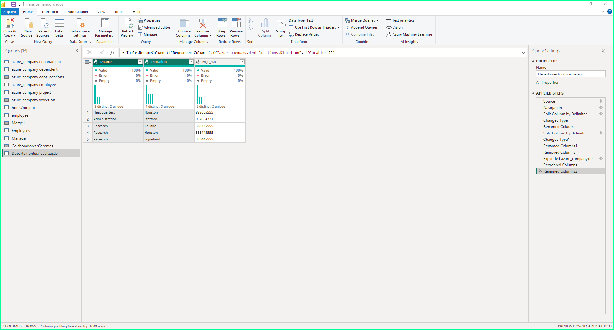
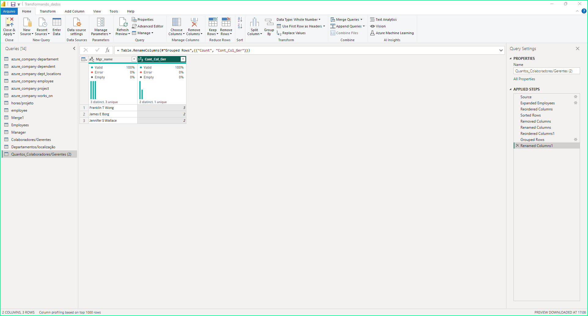

# Transformação de dados com PowerBI
Banco de dados criado com base nos Scripts da pasta [Desafio de Projeto](https://github.com/julianazanelatto/power_bi_analyst/tree/main/M%C3%B3dulo%203/Desafio%20de%20Projeto) no git hub

### Criação de uma instância na Azure para MySQL:
1 - Criado o servidor MYSQL para receber o banco de dados;  
2 - Conectado o Cloud Shell;  
3 - Criado a conexão com o armazenamento;  
4 - Criado Banco de dados a partir do script existente e populado;  
5 - Criado as permissões necessárias para acesso ao banco de dados;  
6 - Conectado o Azure ao Workbench;  
7 - Integrado o Power BI com MySQL na Azure.

### 1 - Verifique os cabeçalhos e tipos de dados 
    - Foi verificado e os cabeçalhos e o Power BI tinha os reconhecido corretamente;
    - Também foi verificado os tipos que haviam sido reconhecidos corretamente.

### 2 - Modifique os valores monetários para o tipo double preciso
    - Foi mudado o tipo da coluna 'Salary' para número decimal fixo



### 3 - Verifique a existência dos nulos e analise a remoção
    - Foi encontrado o valor Null em employee para o funcionário James. Foi mantido o valor Null. Observou-se assim que este é um funcionário de alto cargo.


### 4 -	Os employees com nulos em Super_ssn podem ser os gerentes. Verifique se há algum colaborador sem gerente
    - Não existe colaborador sem gerente, verificado na tabela employee, na coluna 'Super_ssn' em que aparece somente o James E Borge com valor nulo mas na tabela departament na coluna 'Mgr_ssn' aparece como gerente.


### 5 -	Verifique se há algum departamento sem gerente
    - Foi verificado na tabela departament na coluna 'Mgr_ssn' que todos os departamentos possuem gerentes.


### 6 -	Se houver departamento sem gerente, suponha que você possui os dados e preencha as lacunas
    - Não há departamentos sem gerentes, porém se houvesse departamento sem gerente eu clicaria sobre a célula vazia com o botão direito, opção 'replace values' e colocava o valor para substituir isso para cada célula que eu tivesse o dado.

### 7 - Verifique o número de horas dos projetos
    - Para verificar o número de horas mesclei a tabela works_on e a tabela project, deixei somente as colunas hours e project name deletando as colunas desnecessárias e criei um gráfico de área clusterizado.



### 8 -	Separar colunas complexas
    - Separei as datas por dia, mês e ano. Separei também o endereço pelo delimitador hífen (-) e dei o nome para as colunas como Number, ST_AV, City, State. Um dos endereços tinha o nome com 2 palavras em que tive que acertar a coluna que acabou vindo a mais, colocando os dados na devida coluna e removendo a coluna que veio a mais.



### 9 -	Mesclar consultas employee e departament para criar uma tabela employee com o nome dos departamentos associados aos colaboradores. A mescla terá como base a tabela employee. Fique atento, essa informação influencia no tipo de junção
    - Foi mesclado as tabelas employee e departament



### 10 - Neste processo elimine as colunas desnecessárias. 
    - Eliminado colunas desnecessárias



### 11 - Realize a junção dos colaboradores e respectivos nomes dos gerentes. Isso pode ser feito com consulta SQL ou pela mescla de tabelas com Power BI. Caso utilize SQL, especifique no README a query utilizada no processo.
    - Dupliquei as tabelas departament e employee, de cada uma delas uni as colunas do primeiro nome, nome do meio, e ultimo nome para que ficassem em uma só coluna cada. Mesclei as tabelas em consultas pelas chaves e renomei para 'Colaboradores/Gerentes' o nome dessa nova tabela.


    Também pode ser feito pelo código SQL
    select e1.Super_ssn, concat(e1.Fname, ' ', e1.Minit, ' ', e1.Lname) as Empregados, # Nome dos empregados

```
select e1.Super_ssn, concat(e1.Fname, ' ', e1.Minit, ' ', e1.Lname) as Empregados, # Nome dos empregados
concat(e2.Fname, ' ', e2.Minit, ' ', e2.Lname) as Gerentes
FROM azure_company.employee AS e1 
LEFT JOIN azure_company.employee AS e2 ON e1.Super_ssn = e2.Ssn WHERE e1.Super_ssn IS NOT NULL AND e1.Super_ssn <> '' ORDER BY e1.Super_ssn, Empregados;
```

### 12 - Mescle as colunas de Nome e Sobrenome para ter apenas uma coluna definindo os nomes dos colaboradores
    - Mesclado as colunas de Nome e Sobrenome




### 13 - Mescle os nomes de departamentos e localização. Isso fará que cada combinação departamento-local seja único. Isso irá auxiliar na criação do modelo estrela em um módulo futuro.
    - Mesclado os nomes de departamentos e localização


### 14 - Explique por que, neste caso supracitado, podemos apenas utilizar o mesclar e não o atribuir.
    - Pois quando usando a mesclagem de tabelas precisamos de uma chave comum que é a chave Mgr_ssn e funciona igual ao join do SQL que não é o caso da atribuição em que adicionamos ou modificamos valores de uma tabela.

### 15 - Agrupe os dados a fim de saber quantos colaboradores existem por gerente
    - Foi agrupado a coluna de gerentes da tabela Colaborador/Gerente



### 16 - Elimine as colunas desnecessárias, que não serão usadas no relatório, de cada tabela
    - Eliminadas as tabelas desnecessárias
